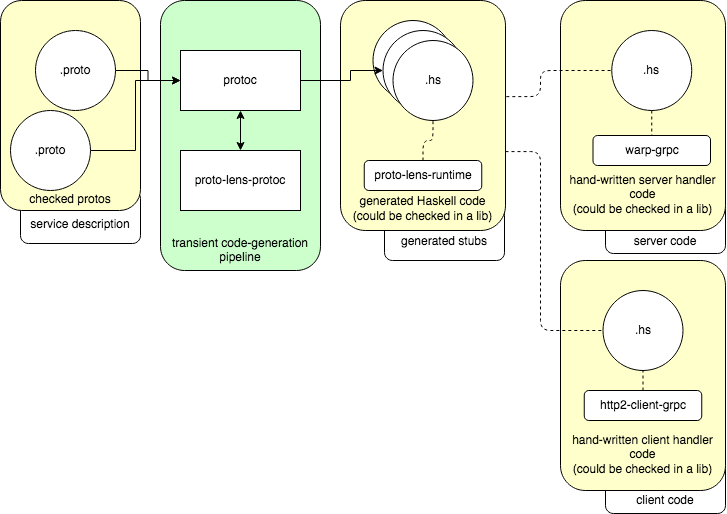

# haskell-grpc-native

This organization and repository aim at providing unofficial
[gRPC](https://grpc.io/) implementations for Haskell using native libraries.

## Context

Haskell is not an [officially supported gRPC language](https://packages.grpc.io/). 
This repository offers a set of libraries that are compatible with gRPC. A main
goal of this initiative is that an intermediate Haskell developper should find
the packages reasonably easy to install and easy to tinker with.

## Repo organization

The code is split in a number of packages following this three ideas:

- share a common types packages
- have server and client-specific packages
- add a serialization-library specific packages

## Usage

We will soon provide examples in this repository. We are currently migrating
repositories from scattered places into this organization.

### Using proto-lens

First, you'll need both `protoc` and `proto-lens-protoc` installed.

In short `protoc` is a protobuf compiler which calls to external program (in
our case `proto-lens-protoc`) to generate an output (in our case, Haskell code
that is part of a library). This process is depicted in the following picture.

Note that the version of `proto-lens-protoc` will determine the version of
`proto-lens-runtime` that you need to import in your project.

**Recommendation:** you can share the generated-code between server and
clients. Hence, we propose to bundle all generated Haskell code in one library
that depends on `proto-lens-runtime` as one _types_ package. Then import this
_types_ package in your client/server applications.

### Using proto3-wire

## Alternatives

There is a [low-level API](https://github.com/grpc/grpc-haskell) in the official gRPC repository.
There also is a [more-complete API](https://github.com/awakesecurity/gRPC-haskell) which uses a binding to the C-library and which is supported by AwakeSecurity.

